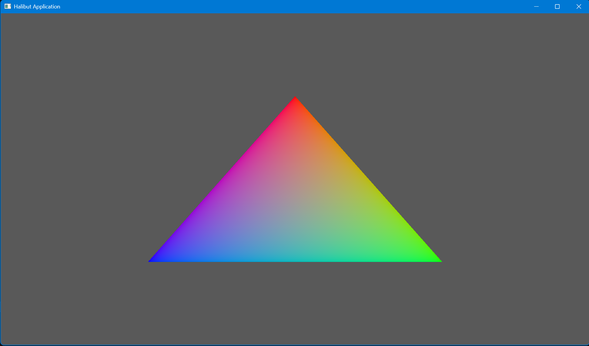

# HALIBUT 大比目鱼渲染器

- 基于 `vulkan` 的渲染器，可用于作为各种软件的底层图形渲染工具

## 配置要求：
- 官方 `Vulkan SDK`
- `glm` 数学库 
- `glfw` 
- `stb_image` 

## 目前版本

能够稳定渲染窗口 
  - 1.0.0
    - `Instance` 创建
    - `Device` 选取
    - `Swapchain` 创建
    - `frame` 帧资源
    - `randerer` 渲染流程闭环
    - 实现`swapchian recreation`
    - 
  - 1.0.1
    - `pipeline`
    - `slangc` compile `shaders`
    - `draw a triangle`
下一步：实现`buffer` 和 `image`
